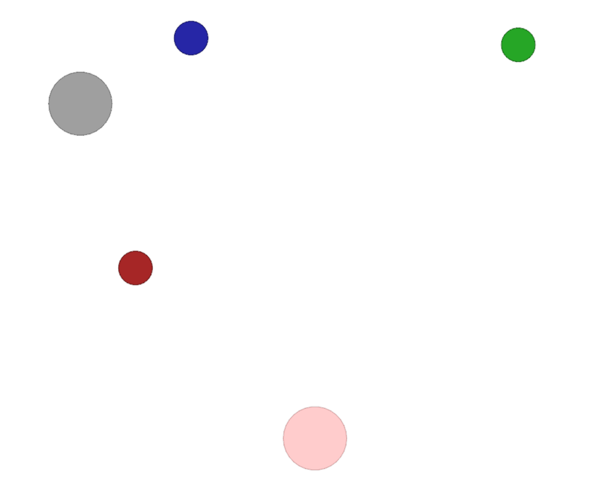
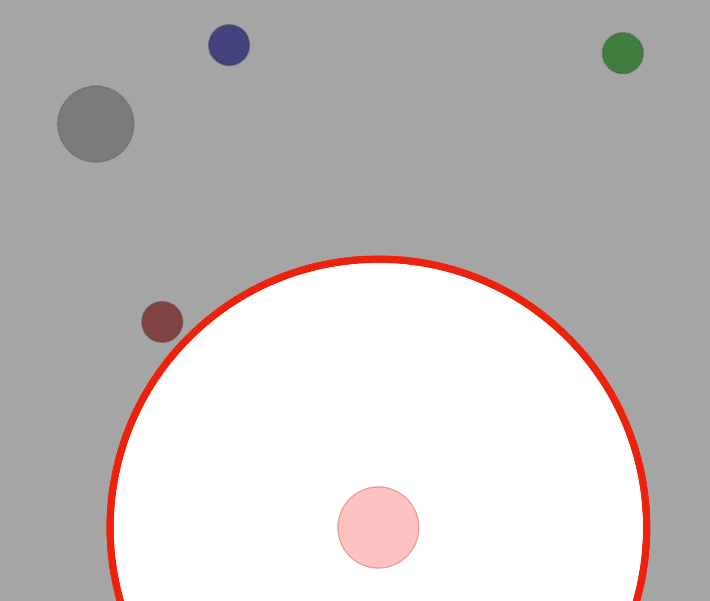
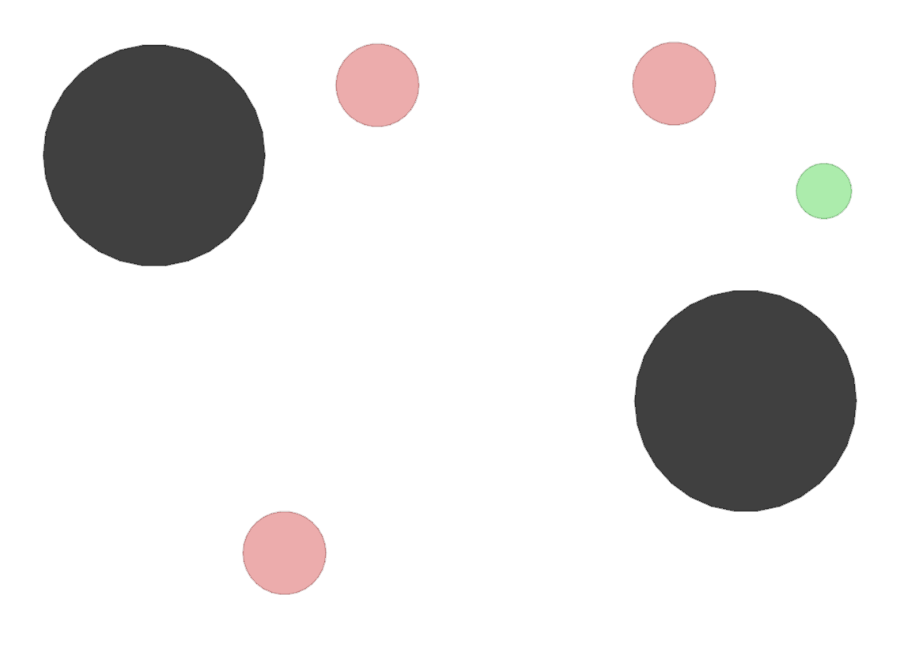
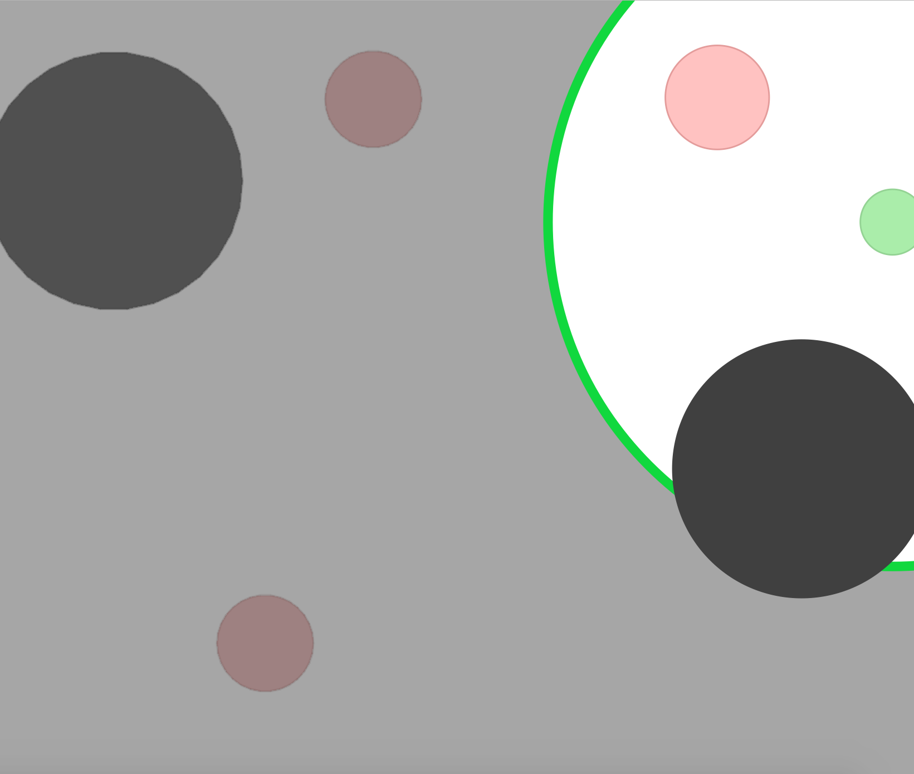

# Multi-Agent Particle Environment

A simple multi-agent particle world with a continuous observation and discrete action space, along with some basic simulated physics.
Used in the paper [Multi-Agent Actor-Critic for Mixed Cooperative-Competitive Environments](https://arxiv.org/pdf/1706.02275.pdf).

## Getting started:

- To install, `cd` into the root directory and type `pip install -e .`

- To interactively view moving to landmark scenario (see others in ./scenarios/):
`bin/interactive.py --scenario simple.py`

- Known dependencies: Python (3.5.4), OpenAI gym (0.10.5), numpy (1.14.5)

- To use the environments, look at the code for importing them in `make_env.py`.

## Code structure

- `make_env.py`: contains code for importing a multiagent environment as an OpenAI Gym-like object.

- `./multiagent/environment.py`: contains code for environment simulation (interaction physics, `_step()` function, etc.)

- `./multiagent/core.py`: contains classes for various objects (Entities, Landmarks, Agents, etc.) that are used throughout the code.

- `./multiagent/rendering.py`: used for displaying agent behaviors on the screen.

- `./multiagent/policy.py`: contains code for interactive policy based on keyboard input.

- `./multiagent/scenario.py`: contains base scenario object that is extended for all scenarios.

- `./multiagent/scenarios/`: folder where various scenarios/ environments are stored. scenario code consists of several functions:
    1) `make_world()`: creates all of the entities that inhabit the world (landmarks, agents, etc.), assigns their capabilities (whether they can communicate, or move, or both).
     called once at the beginning of each training session
    2) `reset_world()`: resets the world by assigning properties (position, color, etc.) to all entities in the world
    called before every episode (including after make_world() before the first episode)
    3) `reward()`: defines the reward function for a given agent
    4) `observation()`: defines the observation space of a given agent
    5) (optional) `benchmark_data()`: provides diagnostic data for policies trained on the environment (e.g. evaluation metrics)

### Creating new environments

You can create new scenarios by implementing the first 4 functions above (`make_world()`, `reset_world()`, `reward()`, and `observation()`).

## List of environments

| Env name in code (name in paper) |  Communication? | Competitive? | Notes |
| --- | --- | --- | --- |
| `simple.py` | N | N | Single agent sees landmark position, rewarded based on how close it gets to landmark. Not a multiagent environment -- used for debugging policies. |
| `simple_adversary.py` (Physical deception) | N | Y | 1 adversary (red), N good agents (green), N landmarks (usually N=2). All agents observe position of landmarks and other agents. One landmark is the ‘target landmark’ (colored green). Good agents rewarded based on how close one of them is to the target landmark, but negatively rewarded if the adversary is close to target landmark. Adversary is rewarded based on how close it is to the target, but it doesn’t know which landmark is the target landmark. So good agents have to learn to ‘split up’ and cover all landmarks to deceive the adversary. |
| `simple_crypto.py` (Covert communication) | Y | Y | Two good agents (alice and bob), one adversary (eve). Alice must sent a private message to bob over a public channel. Alice and bob are rewarded based on how well bob reconstructs the message, but negatively rewarded if eve can reconstruct the message. Alice and bob have a private key (randomly generated at beginning of each episode), which they must learn to use to encrypt the message. |
| `simple_push.py` (Keep-away) | N |Y  | 1 agent, 1 adversary, 1 landmark. Agent is rewarded based on distance to landmark. Adversary is rewarded if it is close to the landmark, and if the agent is far from the landmark. So the adversary learns to push agent away from the landmark. |
| `simple_reference.py` | Y | N | 2 agents, 3 landmarks of different colors. Each agent wants to get to their target landmark, which is known only by other agent. Reward is collective. So agents have to learn to communicate the goal of the other agent, and navigate to their landmark. This is the same as the simple_speaker_listener scenario where both agents are simultaneous speakers and listeners. |
| `simple_speaker_listener.py` (Cooperative communication) | Y | N | Same as simple_reference, except one agent is the ‘speaker’ (gray) that does not move (observes goal of other agent), and other agent is the listener (cannot speak, but must navigate to correct landmark).|
| `simple_spread.py` (Cooperative navigation) | N | N | N agents, N landmarks. Agents are rewarded based on how far any agent is from each landmark. Agents are penalized if they collide with other agents. So, agents have to learn to cover all the landmarks while avoiding collisions. |
| `simple_tag.py` (Predator-prey) | N | Y | Predator-prey environment. Good agents (green) are faster and want to avoid being hit by adversaries (red). Adversaries are slower and want to hit good agents. Obstacles (large black circles) block the way. |
| `simple_world_comm.py` | Y | Y | Environment seen in the video accompanying the paper. Same as simple_tag, except (1) there is food (small blue balls) that the good agents are rewarded for being near, (2) we now have ‘forests’ that hide agents inside from being seen from outside; (3) there is a ‘leader adversary” that can see the agents at all times, and can communicate with the other adversaries to help coordinate the chase. |

## Partial Observability
Additionally, variations using partial oservability are introduced for tasks:

* cooperative communication (`simple_speaker_listener`)
* cooperative navigation (`simple_spread`)
* physical deception (`simple_adversary`)
* predator-prey (`simple_tag`)

This partial-observability is computing the distance of agents to other entities (landmarks and other agents) and obscures their position, velocity etc. in observations if they are outside a pre-defined field of view. Obsured parts of observations are replaced with 0-entries to remain observation dimensionality. The field of view is distance-based and defined as the constant `VIEW_DISTANCE` in `multiagent/scenarios/scenario_util.py`. By default, the viewing distance is set to `0.5`, which corresponds to the visualisations below.

Tasks with partial observability can be found in the scenarios `multiagent/scenarios/simple_speaker_listener_partial_observable.py`, `multiagent/scenarios/simple_spread_partial_observable.py` and so on.

### Visualisations of partial observability for cooperative communication task (`simple_speaker_listener`)
 

### Visualisations of partial observability for predator-prey task (`simple_tag`)
 

## Stochastic Environments

We also introduce two forms of stochasticity to the tasks

* cooperative communication (`simple_speaker_listener`)
* cooperative navigation (`simple_spread`)
* physical deception (`simple_adversary`)
* predator-prey (`simple_tag`)

in the form of various noise. First, we define observation noise. Such noise is simply concatenated to original observations. Hence, agents have to learn to ignore these random values. Secondly, environmental noise is defined. Such noise adds distortion fields in the environments, which randomise observations of agents inside them. Therefore, agents should learn to circumvent these areas, but can actively choose to step inside them (e.g. prey in the predator-prey task).

### Observation noise
Observation noise simply adds random values, drawn from a zero-centered Gaussian distribution, to agent observations. Dimensionality and variance of the noise is defined as `OBS_NOISE_DIM` and `OBS_NOISE_VAR` respectively in `multiagent/scenarios/scenario_util.py`. By default noise dimensionality and variance is defined as 5.

Observation noise scenarios can be found in `multiagent/scenarios/simple_speaker_listener_observation_noise.py`, `multiagent/scenarios/simple_spread_observation_noise.py` and so on.

### Environmental noise
As the name suggests, environmental noise is integrated in the environment. We implement this form of noise using distortion fields. These are landmarks added in the environment of each of the respective tasks. At the beginning, distortion fields are assigned a random location, just as for normal landmarks. They are static and agents can move through them. However, observations of agents inside such a distortion field are heaviy altered by adding random noise. The noise is again drawn from a zero-centered Gaussian with variance `ENV_NOISE_VAR` defined in `multiagent/scenarios/scenario_util.py`. Constant `ENV_NOISE_DISTANCE` defined the size of such a distortion field. By default, variance is set to 5 and the distance is set to 0.5 as for partial observability.

Environmental noise scenarios can be found in `multiagent/scenarios/simple_speaker_listener_env_noise.py`, `multiagent/scenarios/simple_spread_env_noise.py` and so on.

## Paper citation

If you used this environment for your experiments or found it helpful, consider citing the following papers:

Environments in this repo:
<pre>
@article{lowe2017multi,
  title={Multi-Agent Actor-Critic for Mixed Cooperative-Competitive Environments},
  author={Lowe, Ryan and Wu, Yi and Tamar, Aviv and Harb, Jean and Abbeel, Pieter and Mordatch, Igor},
  journal={Neural Information Processing Systems (NIPS)},
  year={2017}
}
</pre>

Original particle world environment:
<pre>
@article{mordatch2017emergence,
  title={Emergence of Grounded Compositional Language in Multi-Agent Populations},
  author={Mordatch, Igor and Abbeel, Pieter},
  journal={arXiv preprint arXiv:1703.04908},
  year={2017}
}
</pre>

Addition of partial observability and stochasticity:
<pre>
@MastersThesis{lukas:thesis:2019,
  title={Curiosity in Multi-Agent Reinforcement Learning}
  author={Schäfer, Lukas},
  school={University of Edinburgh},
  year={2019},
}
</pre>
